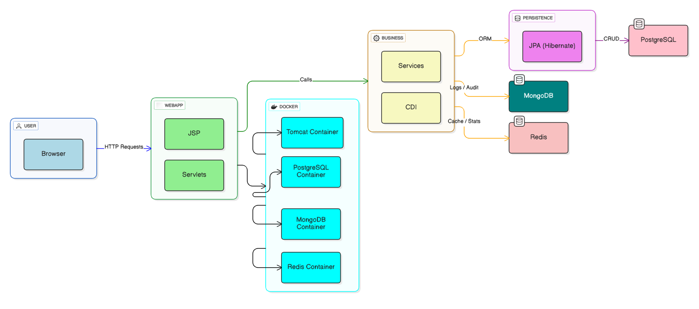

# Hospital Management System

- A comprehensive healthcare management platform built with Jakarta EE, demonstrating modern Java web application architecture with multi-database persistence.

## Overview

This application provides an integrated solution for managing hospital operations including patients, doctors, appointments, and medical records. It leverages a layered J2EE architecture with multiple persistence strategies to ensure scalability and performance.

## Key Features

- Patient and appointment management system
- Multi-database persistence (PostgreSQL for relational data, MongoDB for audit logs, Redis for caching)
- Interactive dashboard with analytics
- Complete REST/Web interface via JSP and Servlets
- Docker containerization for simplified deployment
- Health checks and service orchestration

## Architecture

The application follows a layered architecture pattern:

```
┌─────────────────┐
│   Presentation  │  JSP / HTML / JavaScript
├─────────────────┤
│   Servlet Layer │  HTTP Request Handling (MVC)
├─────────────────┤
│   Service Layer │  Business Logic
├─────────────────┤
│   DAO Layer     │  Data Access Objects (JPA)
├─────────────────┤
│  Persistence    │  PostgreSQL / MongoDB / Redis
└─────────────────┘
```

## System Architecture



The application employs a comprehensive three-tier architecture:

1. **Presentation Layer**: JSP, HTML5, CSS3, and JavaScript for user interface
2. **Business Logic Layer**: Servlets and Services for request handling and business operations
3. **Data Persistence Layer**: Multiple database backends optimized for different use cases
4. **Configuration Layer**: Centralized management of database connections and framework initialization

## Jakarta EE Annotations

This project extensively uses Jakarta Persistence (JPA) annotations for declarative data mapping:

### Entity Annotations

#### @Entity
- Marks a class as a JPA entity that maps to a database table
- Applied to: `Patient`, `Medecin`, `RendezVous`, `DossierMedical`, `ServiceHospitalier`

#### @Table(name = "table_name")
- Specifies the database table name for the entity
- Examples:
  - `@Table(name = "patients")` for Patient entity
  - `@Table(name = "medecins")` for Medecin entity
  - `@Table(name = "rendezvous")` for RendezVous entity

#### @Id
- Marks a field as the primary key of the entity
- Used in all entity classes for unique identification

#### @GeneratedValue
- Specifies how primary keys are generated
- Strategy: `GenerationType.IDENTITY` for auto-incrementing database sequences

#### @Column
- Maps a field to a specific database column
- Parameters include:
  - `name`: Column name in database
  - `nullable`: Whether NULL values are allowed
  - `unique`: Enforces unique constraint
  - `length`: VARCHAR field length

#### @OneToMany / @ManyToOne
- Defines relationships between entities
- Used for managing patient appointments and doctor-patient associations

### Configuration Annotations

#### @Configuration Classes
- **JpaConfig**: Manages EntityManagerFactory initialization with environment-based PostgreSQL connection
- **MongoConfig**: Handles MongoDB client creation for audit logging
- **RedisConfig**: Initializes Jedis connection pools for distributed caching

## Technologies

### Backend
- Java 13+ (compatible with Java 13-19)
- Jakarta EE 10
- JPA / Hibernate ORM 6.4.1
- Jakarta Servlet & JSP
- Jedis (Redis client)
- MongoDB Java Driver

### Databases
- PostgreSQL 15 (relational data)
- MongoDB (audit logs and document storage)
- Redis (real-time caching and statistics)

### Infrastructure
- Docker & Docker Compose
- Tomcat 10.1 application server

### Frontend
- JSP templating
- HTML5 / CSS3
- JavaScript

## Project Structure

```
src/main/
├── java/org/hsc/hospital_management_system/
│   ├── config/          # Database and framework configuration
│   ├── entity/          # JPA entities
│   ├── dao/             # Data Access Objects
│   ├── service/         # Business logic
│   ├── servlet/         # HTTP request handlers
│   └── nosql/           # MongoDB and Redis services
└── webapp/
    ├── jsp/             # JSP templates
    ├── css/             # Stylesheets
    ├── js/              # Client-side scripts
    └── WEB-INF/         # Configuration
```

## Quick Start

### Prerequisites
- Docker and Docker Compose
- Java 13+ (Java 13, 17, or 19 recommended)
- Maven 3.8+

### Installation

1. Navigate to the project directory:
```bash
cd hospital_management_system
```

2. Start all services with Docker Compose:
```bash
docker-compose up -d
```

This will start:
- PostgreSQL database
- MongoDB database
- Redis cache
- Tomcat application server
- Mongo Express (MongoDB UI)

3. Access the application:
- Application: `http://localhost:8080/hospital_management_system`
- Mongo Express: `http://localhost:8081` (username: `admin` / password: `admin`)

### Building from Source

```bash
mvn clean install
mvn package
```

## Database Setup

The PostgreSQL database is automatically initialized with the schema from `init.sql`. MongoDB and Redis are configured for document storage and caching respectively.


## Development

For local development without Docker, ensure the three databases are running and accessible at their default ports (5432, 27017, 6379).

## API Usage

The application exposes REST APIs for all entities:

### Patients API
- **GET** `/api/patients?action=all` - Get all patients
- **GET** `/api/patients?id={id}` - Get patient by ID
- **POST** `/api/patients` - Create new patient (form-urlencoded body)
- **PUT** `/api/patients?id={id}&firstName={name}&lastName={name}...` - Update patient (query parameters)
- **DELETE** `/api/patients?id={id}` - Delete patient

### Doctors API
- **GET** `/api/medecins?action=all` - Get all doctors
- **GET** `/api/medecins?id={id}` - Get doctor by ID
- **POST** `/api/medecins` - Create new doctor
- **PUT** `/api/medecins?id={id}&firstName={name}...` - Update doctor
- **DELETE** `/api/medecins?id={id}` - Delete doctor

### Appointments API
- **GET** `/api/rendezvous?action=all` - Get all appointments
- **POST** `/api/rendezvous` - Create new appointment
- **PUT** `/api/rendezvous?id={id}&action=cancel` - Cancel appointment

**Note:** PUT/DELETE requests should use query parameters instead of request body due to Tomcat servlet configuration.


## Annotations Reference

### CDI (Contexts and Dependency Injection)
- `@Inject` - Injects managed bean instance (used in all servlets for service injection)
- `@ApplicationScoped` - Bean exists for application lifetime, shared across requests (PatientService, MedecinService, RendezVousService, DashboardService, AuditMongoService)

### Jakarta Servlet Annotations
- `@WebServlet("/path")` - Maps servlet to URL pattern (PatientServlet, MedecinServlet, RendezVousServlet, DashboardServlet)

### JPA/Hibernate Entity Annotations
- `@Entity` - Marks class as JPA entity (Patient, Medecin, RendezVous, DossierMedical, ServiceHospitalier)
- `@Table(name="table_name")` - Maps entity to database table
- `@Id` - Marks field as primary key
- `@GeneratedValue(strategy=IDENTITY)` - Auto-increment primary key
- `@Column(name="col_name")` - Maps field to database column
- `@ManyToOne(fetch=LAZY)` - Many-to-one relationship (RendezVous→Patient, RendezVous→Medecin, Medecin→ServiceHospitalier)
- `@OneToMany(mappedBy="field")` - One-to-many relationship (Patient→RendezVous, Patient→DossierMedical, ServiceHospitalier→Medecin)
- `@JoinColumn(name="fk_column")` - Foreign key column specification
- `@Transient` - Excludes field from persistence
- `@PrePersist` - Lifecycle callback before entity insert (sets timestamps)
- `@PreUpdate` - Lifecycle callback before entity update (updates timestamps)

## Troubleshooting

If you encounter container startup issues:
```bash
docker-compose logs -f
```

To restart services:
```bash
docker-compose restart
```

To remove all services and volumes:
```bash
docker-compose down -v
```

